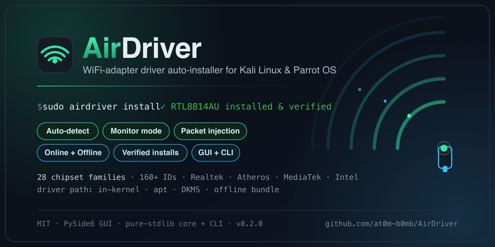
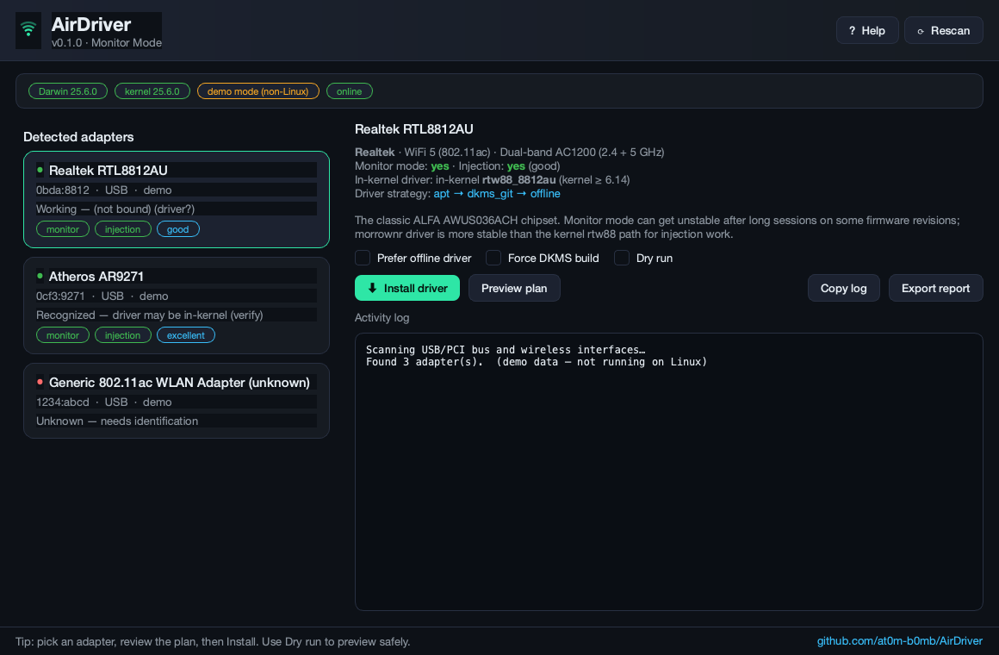
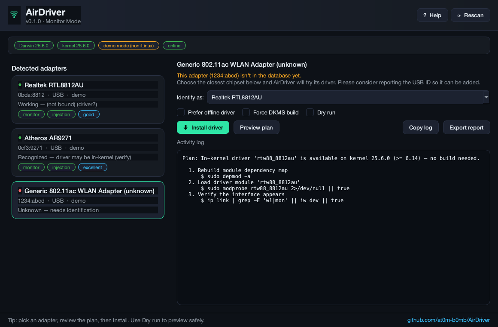

<div align="center">



<br/><br/>

[](https://www.kali.org/)
[](https://www.python.org/)
[](https://doc.qt.io/qtforpython/)
[](airdriver/data/chipsets.json)
[](LICENSE)

**Plug in your adapter → AirDriver identifies the chipset → installs the right driver.**

Built for pentesters who just want monitor mode and packet injection to *work*.
`Realtek` · `Atheros` · `MediaTek/Ralink` · `Intel` — **28 chipset families · 160+ USB/PCI IDs** · hybrid online/offline · a clean GUI **and** a full CLI.

</div>

---

## ⚡ Quick start

```bash
git clone https://github.com/at0m-b0mb/AirDriver
cd AirDriver
sudo ./install.sh        # installs deps + the `airdriver` command
sudo airdriver           # opens the GUI
```

**Don't want to install anything system-wide?** Just run it from the folder:

```bash
git clone https://github.com/at0m-b0mb/AirDriver
cd AirDriver
./run.sh                 # sets up a local env on first run, then launches the GUI
./run.sh scan            # …or any CLI command
```

> **No graphical desktop / over SSH?** Everything works headless from the CLI —
> `airdriver scan`, `airdriver doctor`, `airdriver install`. No GUI libraries needed.

Stuck on the first run? Jump to [**Troubleshooting**](#-troubleshooting) — the two most
common gotchas (the GUI not opening under `sudo`, and Qt `xcb` errors) are solved there.

## Why

Getting an Alfa/Panda/TP-Link adapter working on Kali or Parrot is a rite of passage:
figure out the chipset, find the *right* DKMS repo (half of them are abandoned),
install kernel headers, fight Secure Boot, blacklist the in-tree module… AirDriver
automates all of it and explains what it's doing.

It also solves the **catch-22**: no WiFi driver means no internet, which means you
can't *download* the driver. AirDriver can bundle driver sources offline and build
them on an air-gapped machine.

## Features

- 🔍 **Auto-detection** — enumerates USB (`lsusb`) and PCI (`lspci`) adapters, reads
  live wireless interfaces from sysfs, and maps `VID:PID` → chipset.
- 🧠 **Smart driver selection** — prefers the **in-kernel** driver when your kernel is
  new enough (no pointless DKMS build), otherwise apt → DKMS-from-git → offline bundle.
- 🌐 **Hybrid online/offline** — uses apt/git when connected, falls back to a
  pre-fetched offline copy when not.
- 🩺 **System doctor** — checks kernel headers, DKMS, build tools, **Secure Boot**, and
  root before it ever tries to build, so failures are caught early.
- 🚫 **Conflict handling** — blacklists in-tree modules (e.g. `r8188eu`) that hijack
  adapters meant for the out-of-tree driver.
- 📶 **Monitor mode + injection** — one-click enable/disable and an `aireplay-ng` self-test.
- 🎯 **Honest capabilities** — every chipset is flagged for monitor mode **and** real
  injection quality, so you know before you buy whether a card is attack-grade or
  connect-only.
- 🖥️ **Polished GUI** (PySide6) **and** a complete **CLI** for headless/SSH boxes.
- 📄 **Diagnostic reports** — export JSON + Markdown, perfect for forum help threads.
- ❓ **Unknown-adapter flow** — if your `VID:PID` isn't known yet, pick the closest
  chipset to try and get a reminder to report it.

## Screenshots

<div align="center">

**Main view** — detected adapters, chipset details, capability badges, and live system status (headers · DKMS · Secure Boot):



<br/><br/>

**Unknown adapter?** Identify it from the dropdown and preview the full install plan before anything runs:



</div>

> The screenshots above run on macOS, where AirDriver shows **demo adapters** so the
> GUI is fully previewable without hardware. On Kali/Parrot it detects your real adapters.

## Install & run

### Option A — full install (recommended)

```bash
sudo ./install.sh
```

The installer:
- installs system prerequisites — `dkms`, `build-essential`, kernel headers,
  `usbutils`, `pciutils`, `iw`, `aircrack-ng`, …
- installs the **Qt runtime libraries** the GUI needs (the usual cause of
  *"installed but the window won't open"*),
- creates an isolated virtualenv and installs the GUI (PySide6),
- drops a smart `airdriver` launcher on your PATH.

Then:

```bash
sudo airdriver           # GUI (installs run as root — smoothest)
airdriver scan           # CLI: list detected adapters
airdriver doctor         # CLI: is the system ready to build drivers?
```

> Core + CLI are **pure stdlib** — they run on a stock box with zero pip installs.
> Only the GUI needs `PySide6`.

### Option B — run without installing

```bash
./run.sh                 # GUI    (no root needed; install steps ask for sudo)
./run.sh scan            # or any CLI command
```

### Option C — Make targets

```bash
make install             # = sudo ./install.sh
make gui                 # set up a local venv and launch the GUI
make scan                # CLI scan
make doctor              # CLI readiness check
make offline             # pre-fetch driver sources for air-gapped use
make help                # list everything
```

### Bundle drivers for offline use (do it while online)

```bash
./scripts/fetch_offline_drivers.sh
```

This pre-clones the DKMS driver repos into `airdriver/data/drivers/` so AirDriver can
build them later on a machine with **no internet**.

## Usage

### GUI

```bash
sudo airdriver           # launch the graphical app
```

Pick your adapter from the cards on the left, review the chipset details and the
proposed install plan, then hit **Install driver**. Watch progress stream in the
log. Use **Dry run** to preview without changing anything. The **? Help** button has
a built-in quick start and troubleshooter.

### CLI

```bash
airdriver scan                  # list detected adapters
airdriver doctor                # system readiness (headers, dkms, secure boot…)
airdriver info 0bda:8812        # database details for a usb id / chipset id
airdriver install               # install driver for the first known adapter
airdriver install rtl8812au --dry-run   # preview the plan for a chipset
airdriver install 0bda:c811 --offline   # force the bundled offline driver
airdriver monitor start wlan0   # enable monitor mode
airdriver monitor test wlan0    # aireplay-ng injection self-test
airdriver report                # write a JSON + Markdown diagnostic report
airdriver db                    # dump the chipset database
```

## 🛟 Troubleshooting

**The GUI won't open when I run `sudo airdriver` / I get a Qt `xcb` error.**
This is the #1 issue and AirDriver now handles it for you:
- Running a GUI under `sudo` normally breaks the X11 connection. AirDriver's launcher
  re-attaches your desktop session automatically, so `sudo airdriver` *should* just work.
- If you still see `could not load the Qt platform plugin "xcb"`, the Qt runtime libs
  are missing. Install them:
  ```bash
  sudo apt install -y libxcb-cursor0 libxkbcommon-x11-0 libegl1 \
                      libxcb-icccm4 libxcb-image0 libxcb-keysyms1 \
                      libxcb-randr0 libxcb-render-util0 libxcb-shape0
  ```
  (`sudo ./install.sh` installs all of these for you.)

**`airdriver: command not found` after installing.**
The launcher went to `~/.local/bin` (non-root install). Add it to your PATH:
```bash
echo 'export PATH="$HOME/.local/bin:$PATH"' >> ~/.bashrc && source ~/.bashrc
```
…or just re-run `sudo ./install.sh` to put it in `/usr/local/bin`, or use `./run.sh`.

**`error: externally-managed-environment` when I tried `pip install`.**
That's modern Debian/Kali (PEP 668) blocking system-wide pip. Don't fight it — use
`./install.sh` or `./run.sh`; both create an isolated virtualenv that side-steps it.

**No display at all (headless box / SSH).**
Skip the GUI entirely — the CLI does everything: `airdriver scan`, `doctor`, `install`,
`monitor`, `report`.

**My adapter shows up as "unknown".**
Select it, choose the closest chipset under **Identify as** (GUI) or run
`airdriver install <vid:pid>` (CLI). Please [open an issue](https://github.com/at0m-b0mb/AirDriver/issues)
with the `VID:PID` so it can be added to the database.

## Supported chipsets

AirDriver knows **28 chipset families** spanning 160+ USB/PCI IDs. Capabilities are
honest — some chips connect fine but can't inject, and AirDriver tells you up front.

### 🏆 Attack-grade — reliable monitor mode + injection

| Chipset | Typical adapters | Bands | Injection | Driver path |
|---|---|---|---|---|
| **MT7612U** | Alfa AWUS036ACM, Panda PAU09 | 2.4+5 AC1200 | **excellent** | in-kernel (4.19+) |
| **RTL8187** | Alfa AWUS036H | 2.4 G | **excellent** | in-kernel |
| **AR9271** | Alfa AWUS036NHA, TL-WN722N **v1** | 2.4 N | **excellent** | in-kernel + firmware |
| **RTL8812AU** | Alfa AWUS036ACH | 2.4+5 AC1200 | good | apt → DKMS → offline (in-kernel 6.14+) |
| **RTL8814AU** | Alfa AWUS1900 | 2.4+5 AC1900 | good | apt → DKMS → offline (in-kernel 6.16+) |
| **AR7010** | Alfa AWUS051NH v2 | 2.4+5 N | good | in-kernel + firmware |
| **RT3070 / RT5370** | Alfa AWUS036NH, Panda PAU06 | 2.4 N | good | in-kernel (rt2800usb) |
| **RT3572 / RT5572** | Alfa AWUS051NH/052NH, Panda PAU09 | 2.4+5 N | good | in-kernel (rt2800usb) |
| **MT7610U** | Alfa AWUS036ACHM | 2.4+5 AC600 | good | in-kernel (4.19+) |
| **MT7921AU** | Alfa AWUS036AXML, Brostrend AX9L | WiFi 6E | good | in-kernel (5.18+) |
| **MT7925U** | Netgear A9000 | WiFi 7 | good | in-kernel (6.7+) |

### 👍 Works — fair injection

| Chipset | Typical adapters | Bands | Driver path |
|---|---|---|---|
| RTL8811AU/8821AU | Alfa AWUS036ACS | 2.4+5 AC600 | apt → DKMS → offline (in-kernel 6.14+) |
| RTL8811CU/8821CU | TP-Link T2U Nano/Plus | 2.4+5 AC600 | apt → DKMS → offline |
| RTL8822BU/8812BU | TP-Link Archer T3U/T4U v3 | 2.4+5 AC1200 | apt → DKMS (morrownr 88x2bu) |
| RTL8188EUS | TL-WN722N **v2/v3** | 2.4 N | DKMS (blacklists `r8188eu`) |
| RTL8192EU | TL-WN822N v4/v5 | 2.4 N | apt → DKMS |
| RTL8852BU/8832BU | Alfa AWUS036AXM | WiFi 6 | DKMS (morrownr) / in-kernel 6.17+ |
| RTL8852CU/8832CU | generic AXE | WiFi 6E | DKMS (morrownr) / in-kernel 6.19+ |

### 🔌 Connect-only — gets you online, **not** for attacks

| Chipset | Notes |
|---|---|
| RTL8192CU / RTL8188CUS | Edimax EW-7811Un, TL-WN725N v2 — flaky monitor, unreliable injection |
| RTL8723BU | WiFi+BT combo dongles — connectivity only |
| RTL8188FU | cheap mini dongles — limited monitor |
| MT7601U | ultra-cheap nano — monitor sniffing only, **no injection** |
| AR9170 (carl9170) | legacy draft-N — weak injection |

### 💻 Internal laptop cards (PCIe) — fixes "no WiFi after install"

| Chipset | Notes |
|---|---|
| RTL8821CE / RTL8822CE | very common Lenovo/HP/Acer cards — `rtw88`, connectivity only |
| RTL8723DE | budget laptops — `rtw88`, connectivity only |
| Intel AX200 / AX201 / AX210 / AX211 | `iwlwifi` — monitor works, injection unreliable |

> The full database lives in [`airdriver/data/chipsets.json`](airdriver/data/chipsets.json)
> and is trivial to extend — add a `VID:PID` or a whole chipset and AirDriver picks it up.
> See [Adding a chipset](#adding-a-chipset).

## How driver selection works

```
detect adapter ─► match VID:PID ─► chipset
                                     │
            ┌────────────────────────┼─────────────────────────────┐
   in-kernel driver exists      online?                        offline bundle
   & kernel new enough           │   │                          present?
        │                       yes  no                            │
   load + verify            apt pkg   └─► DKMS from git ◄───────────┘
   (no build)               (fast)        (compile + dkms install)
```

Before any build, AirDriver verifies kernel headers, DKMS, and build tools are
present, warns about Secure Boot, and blacklists conflicting in-tree modules.

## Adding a chipset

The whole database is one JSON file — no code changes needed. Add an entry (or just a
`VID:PID` to an existing one) to [`airdriver/data/chipsets.json`](airdriver/data/chipsets.json):

```jsonc
{
  "id": "rtl8812au",
  "name": "Realtek RTL8812AU",
  "monitor_mode": true,
  "injection": true,
  "injection_quality": "good",
  "usb_ids": ["0bda:8812", "2357:0103"],
  "kernel_native": {"module": "rtw88_8812au", "min_kernel": "6.14"},
  "drivers": [
    {"method": "apt", "package": "realtek-rtl88xxau-dkms", "priority": 1},
    {"method": "dkms_git", "repo": "https://github.com/morrownr/8812au-20210820", "priority": 2}
  ]
}
```

Find your adapter's ID with `lsusb` (USB) or `lspci -nn` (PCI), then open a PR — or an
issue with the ID and we'll add it.

## ⚠️ Responsible use

AirDriver installs drivers and toggles monitor mode for **authorized** wireless
security testing, research, and education. Monitor mode / packet injection on
networks you don't own or have written permission to test may be illegal. You are
responsible for staying within the law and your rules of engagement.

## Project layout

```
AirDriver/
├── airdriver/
│   ├── core/            # detection, database, system probes, install engine
│   │   ├── chipset_db.py    detector.py   system.py
│   │   ├── installer.py     monitor.py    modules.py   report.py
│   ├── data/chipsets.json   # the chipset → driver database (28 families)
│   ├── data/drivers/        # offline driver bundle (populated by script)
│   ├── gui/             # PySide6 app (theme, main window)
│   └── cli.py           # full-featured command line
├── scripts/fetch_offline_drivers.sh
├── install.sh           # full system installer
├── run.sh               # zero-install quick launcher
└── Makefile             # convenience targets
```

## Roadmap ideas

- Community VID:PID submission endpoint for unknown adapters
- MOK signing helper for Secure Boot systems
- Per-adapter TX-power / regulatory region tweaks
- Bootable USB persistence profile
- AppImage / `.deb` packaging

## License

MIT © [at0m-b0mb](https://github.com/at0m-b0mb)
